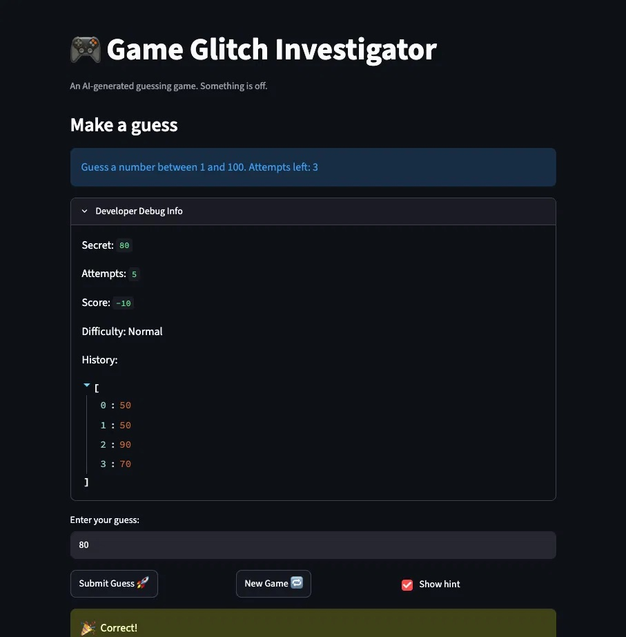
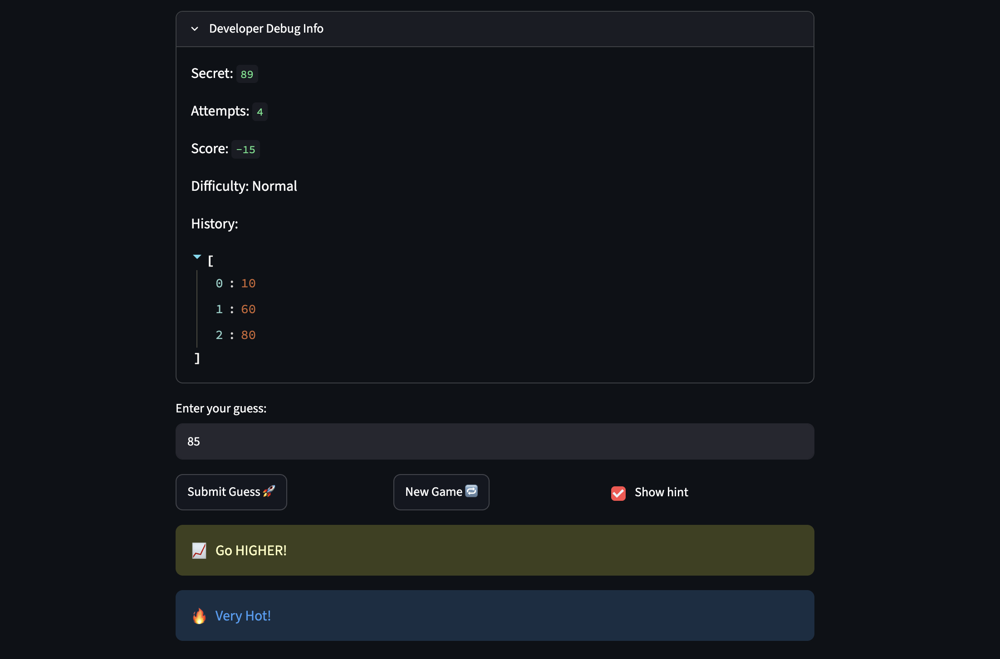

# 🎮 Game Glitch Investigator: The Impossible Guesser

## 🚨 The Situation

You asked an AI to build a simple "Number Guessing Game" using Streamlit.
It wrote the code, ran away, and now the game is unplayable. 

- You can't win.
- The hints lie to you.
- The secret number seems to have commitment issues.

## 🛠️ Setup

1. Install dependencies: `pip install -r requirements.txt`
2. Run the broken app: `python -m streamlit run app.py`

## 🕵️‍♂️ Your Mission

1. **Play the game.** Open the "Developer Debug Info" tab in the app to see the secret number. Try to win.
2. **Find the State Bug.** Why does the secret number change every time you click "Submit"? Ask ChatGPT: *"How do I keep a variable from resetting in Streamlit when I click a button?"*
3. **Fix the Logic.** The hints ("Higher/Lower") are wrong. Fix them.
4. **Refactor & Test.** - Move the logic into `logic_utils.py`.
   - Run `pytest` in your terminal.
   - Keep fixing until all tests pass!

## 📝 Document Your Experience

- [ ] Describe the game's purpose.

The Game Glitch Investigator is a number guessing game built with Streamlit. The player tries to guess a secret number within a set range, and the game gives "Too High" or "Too Low" hints after each guess until the player wins or runs out of attempts.

- [ ] Detail which bugs you found.

I found six bugs. The hint logic was completely inverted, telling players to go the opposite direction of where the secret number actually was. The score did not reset when starting a New Game, and the game became unplayable afterward since no new guesses could be submitted. The game also accepted out-of-range guesses, like 101 when the max was 100, or 60 in Hard mode when the max should have been 50. Changing the difficulty updated the sidebar but not the main game text, and submitting a guess required two clicks before the hint actually appeared.

- [ ] Explain what fixes you applied.

I fixed the two most impactful bugs out of the six I found. For the inverted hints, I corrected the inverted messages in check_guess so the direction actually matches the guess, then moved the function from app.py into logic_utils.py as instructed. For the New Game bug, I added resets for score, status, and history to the button handler, since it was previously only resetting attempts and the secret number. Both fixes are confirmed working in the live game and are covered by pytest tests.

## 📸 Demo Walkthrough

Describe your fixed game in numbered steps so a reader can follow along without watching a video:

1. User enters a guess of 50
2. Game returns "Go Higher!" and score updates to -5
3. User enters a guess of 90 → "Go Lower!", score updates to -10
4. User enters a guess of 70 → "Go Higher!", score stays at -10
5. User enters a guess of 80 → "Correct!"
6. Game ends after the correct guess

**Screenshot** *(optional)*: <!-- Insert a screenshot of your fixed, winning game here -->



## 🧪 Test Results

```
fatimachaudhry@Fatimas-Air ai110-module1show-gameglitchinvestigator-starter % pytest
================================ test session starts ================================
platform darwin -- Python 3.13.13, pytest-9.0.3, pluggy-1.6.0
rootdir: /Users/fatimachaudhry/Downloads/Codepat/ai110-module1show-gameglitchinvestigator-starter
plugins: anyio-4.13.0
collected 6 items

tests/test_game_logic.py ......                                                [100%]

================================= 6 passed in 0.64s =================================
```

## 🚀 Stretch Features

- Challenge 4: Enhanced Game UI
I added a Hot/Cold proximity indicator that shows alongside the existing hint after each guess. The new get_proximity_hint(guess, secret) function in logic_utils.py returns "🔥 Very Hot!" if the guess is within 5 of the secret, "🌡️ Warm" if it's within 15, and "❄️ Cold" otherwise. It's called from app.py inside the show_hint block, right after the existing "Too High"/"Too Low" message, and is skipped on a winning guess since "Correct!" already covers that case. The function is covered by six pytest tests, including boundary checks at exactly 5 and 15, and a test confirming it still works correctly even when the secret is passed in as a string, since the game has a known glitch where the secret gets stringified on every other attempt.

